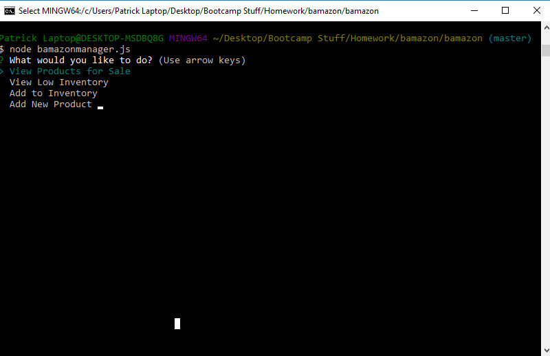

# bamazon

Bamazon is an inventory-management node application that utilizes MYSQL to track and manage inventory items.  It is broken up into multiple parts that are capable of managing items from a single database.

It is capable of: 
1.  Updating on-hand stock from purchases, buying single or multiple items at a time.  Before approving a purchase it will check current stock and not allow a purchase if there is not enough to fulfil an order.

2.  Showing a full list of available products, sorted by product code and displaying: item name, product name, the department, price, and quantity remaining.

3.  Showing which products are running low(i.e. which products are below 5 quantity remaining).

4.  Adding additional stock of existing items.

5.  Adding completely new items.

### Using the App

Start by navigating to the bamazon application folder on your computer terminal, and ensure the proper packages to run the application are installed:
```
npm install
```

Upon successful installation, to complete a purchase and update the database:
```
node bamazoncustomer.js
```

You may then follow the prompts to complete the purchase.
! [alt text](images/purchase2.png)
 

To access manager functions run:
```
node bamazonmanager.js
```


1.  "View Products for sale" will bring up a list of all items for sale in the database.


2.  "View Low Inventory" will bring up a list of all inventory items with an on-hand count lower than 5.


3.  "Add to Inventory"  will prompt you to pick and item, and then allow you to add an amount to the available on-hand.


4.  "Add New Product" will prompt you to add a new product, starting with the name, going through to its department, price, and its on-hand amount.

